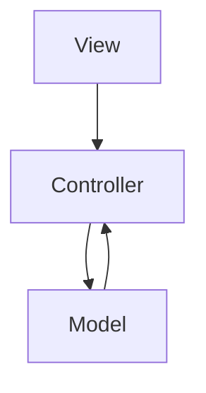
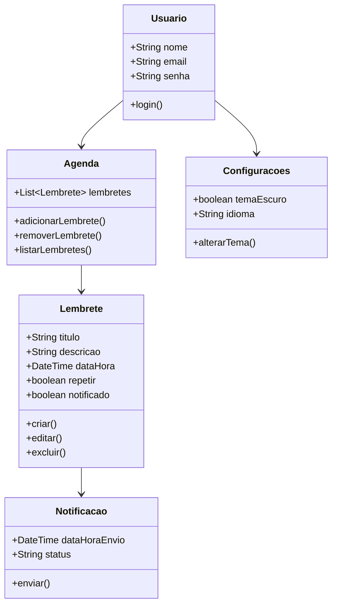

# Documentação do Projeto Integrador - Agenda Pro

## 1. Definição da Arquitetura do Sistema

### Estilo Arquitetural Escolhido

**MVC (Model-View-Controller)** com inspiração em arquitetura em camadas. A escolha foi feita por ser um padrão amplamente utilizado em aplicativos Flutter, facilitando a separação de responsabilidades entre interface, lógica de negócio e persistência (mesmo que temporária).

### Justificativas:

* **Complexidade moderada:** funcionalidades simples e focadas
* **Reutilização e manutenção:** MVC permite fácil extensão
* **Testabilidade:** camadas independentes facilitam testes
* **Restrito a client-side:** sem backend neste momento

### Componentes Principais:

* **View (UI):** telas Flutter responsáveis por exibir lembretes e interações
* **Controller:** gerencia eventos, atualiza o modelo e notifica a view
* **Model:** representa dados como `Lembrete`, `Usuario`, `Agenda`

### Diagrama Arquitetural (Mermaid)

### Interfaces e Comunicação

* View invoca funções do Controller
* Controller acessa o Model diretamente

## 2. Modelagem de Classes (UML)

## 3. Aplicação dos Princípios SOLID

### SRP - Responsabilidade Única

* Cada classe foi desenhada com uma responsabilidade clara:

  * `Usuario`: dados de login
  * `Lembrete`: dados do lembrete
  * `Agenda`: gerenciamento de lista
  * `Notificacao`: envio de alertas

### OCP - Aberto/Fechado

* As classes são abertas para extensão (ex: mais tipos de notificação), mas fechadas para alteração direta

### LSP - Substituição de Liskov

* Previsto uso futuro de subclasses (ex: `NotificacaoEmail`), sem quebrar comportamento esperado

### ISP - Segregação de Interfaces

* Interfaces são focadas e pequenas (se aplicável futuramente)

### DIP - Inversão de Dependência

* Controladores podem depender de interfaces em vez de classes concretas (em plano futuro com injeção de dependência)

## 4. Justificativa das Decisões de Design

### Arquitetura MVC

**Alternativas consideradas:** arquitetura por função, monolítica simples
**Critérios:** manutenção, clareza, organização, praticidade no Flutter

### Entidades Modeladas

**Critérios:** representação direta dos dados da aplicação e das funcionalidades descritas no backlog

### Riscos

* Aumento de complexidade caso funcionalidades como sincronização em nuvem sejam adicionadas sem reestruturação
* Ausência de backend pode limitar integrações

### Estratégias de Mitigação

* Separar responsabilidades desde o início (como estamos fazendo)
* Planejar expansão modular para integrações futuras

## 5. Plano de Implementação

### Sequência

1. View e Model de `Lembrete`
2. Agenda (lista e filtro)
3. Tela de login e usuário
4. Notificações locais
5. Configurações e tema

### Dependências

* `Usuario` é base para login
* `Lembrete` depende da estrutura de `Agenda`
* Notificação depende do `Lembrete`

### Testes

* Testes manuais inicialmente por tela e função
* Automatização possível via widget tests do Flutter

## 6. Diário de Bordo (Resumo da Semana)

* Refinamos o backlog com MoSCoW e estimativas
* Criamos a Definition of Ready no JIRA
* Geramos o diagrama de classes e diagramas draw\.io
* Definimos arquitetura baseada em MVC
* Modelamos os componentes com clareza
* Planejamos a sequência de implementação

Próximos passos:

* Começar implementação do MVP
* Validar funcionalidades com base na Definition of Done
* Testar integrações e tema escuro
